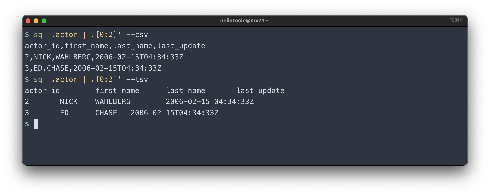

`sq` can output in many formats, e.g. `text` or `json`. It can also write
results to a database, using [`--insert`](#insert). The output format
can be specified using command-line flags (e.g. `--text`, `--json` etc.), or
it can be set using config. The default is `text`.

```shell
# Execute a query, and output in CSV
$ sq '.actor | .first_name, .last_name' --csv

# Check default format
$ sq config get format

# Set config format
$ sq config set format json

# View list of output formats
$ sq config set format --help
...
Available formats:

  text, csv, tsv, xlsx,
  json, jsona, jsonl,
  markdown, html, xlsx, xml, yaml, raw
```

The output format applies to queries (e.g. `sq .actor --json`), and also to
other `sq` commands, e.g. `sq inspect @sakila --yaml`. Not every
command implements each format. For example, there's no `xml` output format
for `sq version`. But every command (except for `help`) supports at least `text`
and `json` output.

## Modifiers

### verbose

The `--verbose` (`-v`) flag does not affect the output of a `sq` query, but
it frequently modifies the behavior of other `sq` commands.


`-v` works with a significant number of `sq` commands. Give it a try.
It can also be set via [config](/docs/config#verbose).


### header

Some formats optionally display a header row. This is controlled via
`--header` (`-h`) or `--no-header` (`-H`).
Or set via [config](/docs/config#header). The default is to print the header.


### compact

For some formats, the `--compact` (`-c`) flag prints compact instead of
pretty-printed output. It can also be set via [config](/docs/config#compact).

JSON is the main use case for `--compact`. This example outputs a query in compact JSON (`-jc`), followed by the same
query in pretty JSON.


### monochrome

Use `--monochrome` (`-M`) flag to output without color. Or set via [config](/docs/config#monochrome).


### datetime

By default, `sq` outputs timestamps in an [IS08601](https://en.wikipedia.org/wiki/ISO_8601)
format, in [UTC](https://en.wikipedia.org/wiki/Coordinated_Universal_Time), e.g. `2020-06-11T02:50:54Z`.

You can use [`--format.datetime`](/docs/config/#formatdatetime) to specify a [pre-defined](/docs/config/#formatdatetime)
format such as `unix` or `RFC3339`. Or you can supply an arbitrary
[`strftime`](https://pubs.opengroup.org/onlinepubs/009695399/functions/strftime.html)
format, such as `%Y/%m/%d %H:%M:%S`.


Similarly [`--format.date`](/docs/config/#formatdate)
and [`--format.time`](/docs/config/#formattime) control the rendering of
date and time values.


There are yet more formatting options available. Check out the full list
in the [config guide](/docs/config/#formatting).


## Formats

### text

`text` (`-t`) is the default format.


### json

`json` (`-j`) outputs an array of JSON objects. Use `-c` (`--compact`) to output
compact instead of pretty-printed JSON.


### jsona

`jsona` (`-A`) outputs JSON Array. This is LF-delimited JSON arrays of values, without keys.


### jsonl

`jsonl` (`-l`) outputs JSON Lines. This is LF-delimited JSON objects.


<a id="tsv" />

<a id="csv" />

### csv, tsv

`csv` (`-C`) outputs [Comma-Separated Values](https://en.wikipedia.org/wiki/Comma-separated_values).
Its twin `tsv` (`-T`) outputs [Tab-Separated Values](https://en.wikipedia.org/wiki/Tab-separated_values).




### markdown

`markdown` outputs markdown tables.


### html

`html` outputs a table in a HTML document.


### xml

`xml` (`-X`) outputs an XML document.


### xlsx

`xlsx` (`-x`) outputs an Excel `.xlsx` document.


### yaml

`yaml` (`-y`) outputs YAML.


### raw

`--raw` outputs each record field in raw format without any encoding or delimiter.


This is more commonly used with `BLOB` fields.


Typically you want to send raw output to a file.

```shell
$ sq '.images | .data | .[0]' --raw > gopher.gif; open gopher.gif
```



On macOS, a handy trick is to pipe `BLOB` output directly to `Preview.app`.

```shell
$ sq '.images | .data | .[0]' --raw | open -f -a Preview.app
```



## Insert

Use the `--insert @SOURCE.TABLE` flag to write records to a table. This
powerful mechanism can be used to move data from one source to another.
If the named table does not exist, it is created.

```shell
$ sq '.actor | .[0:2]' --insert @sakila/pg12.actor_import
Inserted 2 rows into @sakila/pg12.actor_import
```


